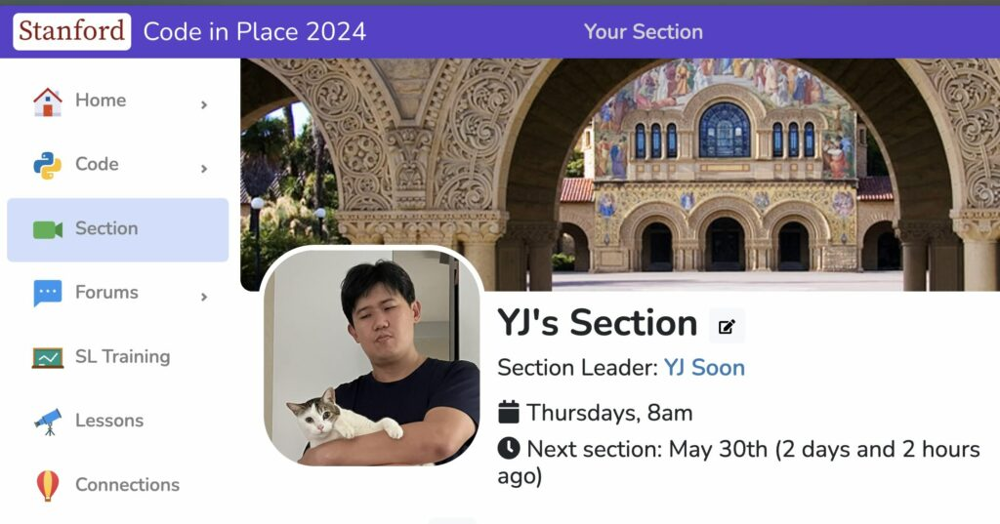

This week, I finished my final weekly volunteer session with my [Code in Place](https://codeinplace.stanford.edu) section for 2024. Code in Place is a free online introductory programming course offered by Stanford University, teaching the fundamentals of Python programming based on the university's flagship CS106 course.

CS106 has been a huge inspiration for me ever since I took the class in fall quarter of freshman year (in 1999!), and especially since I took CS198, the course where they taught us to run our own sections. I don't think I'm overstating things when I say that CS106 + CS198 have been transformative experiences for me: My times section leading for CS106 were some of my fondest Stanford memories, and the inspiration and energy from then have informed my career for the last 15–20 years as an educator here. I'm not certain we'd have [Tinkercademy](https://tinkercademy.com) or [Swift Accelerator](https://swiftinsg.org) now if I hadn't been through those.  

Thanks to all my students, mostly from halfway around the world, for showing up every week, putting in the work, and for participating actively in class. This was some of the most fun I've had teaching an online class in a while. (Yes, the cat made an appearance during section.)  

The Code in Place team remains a huge inspiration — thanks to profs [Chris Piech](https://www.linkedin.com/in/chris-piech-44b726a/), [Mehran Sahami](https://www.linkedin.com/in/mehransahami/), and the rest of the team at Stanford CS for this opportunity, all the teaching training materials, and for making this available to everyone.  

Super cool too that I managed to reconnect with Leoson — an ex-student from over a decade ago when he was in high school — as a section leader whose post I happened to stumble upon in the forums!  

