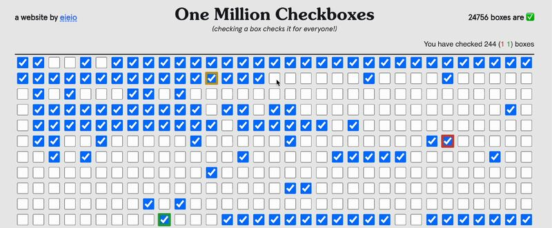

In June, a programmer, Nolen Royalty or "eieio", released a web-based mini-game, [onemillioncheckboxes.com](http://onemillioncheckboxes.com/), which allowed users to check or uncheck any of 1,000,000 checkboxes — and when they did, it changed for everyone viewing the site simultaneously. The goal was to get everything checked at once, which was nigh-impossible. The site went viral: 500,000 people ended up checking more than 650 million boxes in just two weeks. The Washington Post described it as "the most pointless site on the internet; it's fantastic".

In August, eieio detailed an unexpected, and remarkable, outcome of the game in [this blog post](https://eieio.games/blog/the-secret-inside-one-million-checkboxes/) :

*   Some technically-savvy teens discovered they could do more than just random clicking.
*   They realised they could encode the messages as binary data (1s and 0s), and began doing all kinds of weird tricks to send secret messages and graphics to anyone who could decode them.
*   eieio followed the breadcrumbs, and found the teens on a private Discord chat!
*   He had a great time chatting with them, and was just genuinely blown away by their ingenuity.

I _loved_ this!

First, because the initial product was about making something useless and fun — and I always love seeing useless and fun things my students create with code.

Second, because this useless and fun thing managed to inspire young people to form their own learning communities, share discoveries, and build on one another's ideas.

It speaks to what I'd like to achieve as an educator — create spaces and enable students to explore, experiment, and find their own paths to understanding, perhaps in ways that I never anticipated.  
  
I also really liked how he closed his [video version of the blog post](https://www.youtube.com/watch?v=OI4DbECnp8A):

> I found this so moving. As a kid, I spent a lot of time doing dumb stuff on the computer, and I didn't get in too much trouble for it, like when I, for example, repeatedly crashed my high school mail server. There's no way that I would be doing what I do now without the encouragement of people back then. So providing a playground like this, getting to see what they were doing, getting to provide some encouragement saying, "Hey, this is amazing!", was so special for me. The people in that Discord are so extraordinarily talented, so creative, and so cool. I cannot wait to see what they go on to make.

The blog post and video are great, but watch out for some swearing and crude humour in the screenshots, if any teachers reading this want to send them along to students 😄
