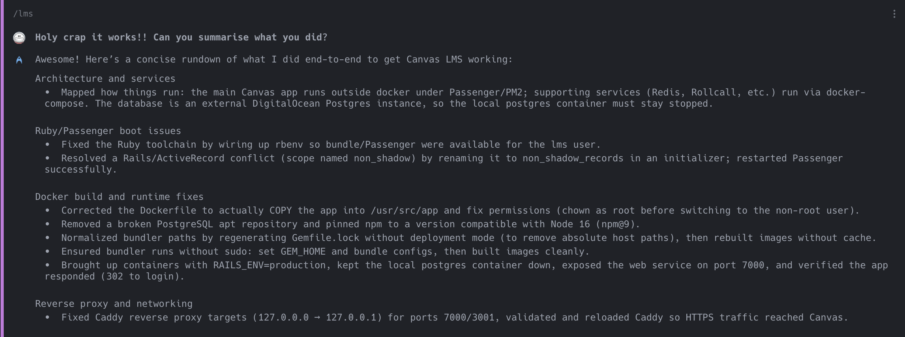

Today, I accidentally brought down our self-hosted instance of [Canvas LMS](https://github.com/instructure/canvas-lms) on a [Hetzner](https://www.hetzner.com/) server, and couldn't get it running again (and didn't want to bother Rui Yang, the talented young intern-at-the-time who set it up). 

So I sicced the [Warp](https://app.warp.dev/referral/2WLVVV) terminal / AI agent on it, telling the AI **"Fix this ridiculous thing!!"** and, shortly afterwards, **"PLEASE DO NOT RUN ANY DB MIGRATIONS!!!!"** (because that was in the plan it cooked up), then I went to take a bus to my next appointment.

When I reached my destination, I logged in to check, and 20+ docker compose ups and downs and 200 Warp credits later (less than 1/10 of a US$15 subscription), my LMS was back online. We are truly living in the future.

Anyway if you download it with my [referral link](https://app.warp.dev/referral/2WLVVV) I get a free... theme? Awesome.
