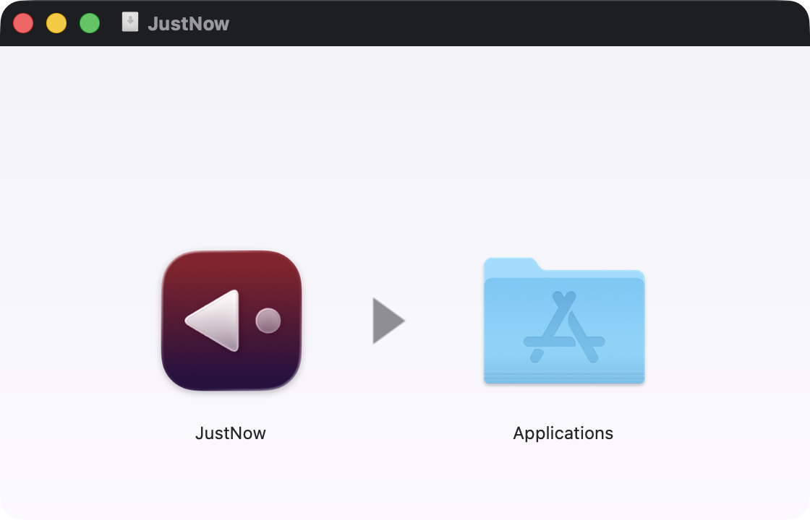

import TwitterEmbed from "@/components/TwitterEmbed.astro";

I made a free macOS app! It's called JustNow, and you can download it at [justnow.tk.sg](https://justnow.tk.sg). It's a very simple app that does just a few things:

- Records (well, takes screenshots of) your screen
- Lets you summon it with a keyboard shortcut (⌘⌥J by default)
- Scrub to find something you missed from the last few minutes
- Drag to select text, and use OCR to get it as text in your clipboard

That's it! It's all locally saved, pretty lightweight, and none of your screenshots gets passed through an AI that wants to help you reflect on your browsing habits.

I made this because I have fat fingers and close windows accidentally all the time, and I also get super annoyed when I submit a form and it fails, and I need to end up using the actual neurons in my brain to think about what I had been typing. Having to think! In this day and age! A travesty!!

I used to use an app called Rewind.app, but it got [bought by Meta and shut down](https://9to5mac.com/2025/12/05/rewind-limitless-meta-acquisition/). (Windows users have [Recall](https://support.microsoft.com/en-us/windows/retrace-your-steps-with-recall-aa03f8a0-a78b-4b3e-b0a1-2eb8ac48701c), which had its [share of controversy](https://en.wikipedia.org/wiki/Windows_Recall), but is apparently out now, and full of AI.) I tried various open source and commercial Mac apps, but none of them fit the bill for me, and I kept losing text that I'd written and getting super grumpy.

Until, one day last year, I remembered, I could make this myself now! Or rather, I could get an AI agent to just make the thing that I wanted exist. In the spirit of personal software — apps made just for you; read about [Robin Sloan's BoopSnoop](https://www.robinsloan.com/notes/home-cooked-app/) and [Maggie Appleton's talk on Home-Cooked Software](https://maggieappleton.com/home-cooked-software) — I fired up Claude Code, Codex, XcodeBuildMCP, some long-buried memories about how to settle macOS developer signing, a bunch of skills, whatever Chinese AI providers I randomly subscribed to whenever I ran out of Claude and Codex tokens, and just... made the thing.

I've also been watching folks from the [Agentic Builders Collective](https://agenticbuilders.sg) community build and release their apps in public — join us at [agenticbuilders.sg](https://agenticbuilders.sg)! — and it's been great fun trying out new things that people have made. Shout-out to Gijs Verheijke and PJ Teh for putting out their own apps.

Funny story: When Gijs released his [MarkJason](https://markjason.sh/) app for Markdown editing on Mac, I over-enthusiastically sent (spammed) him a dozen unsolicited bug reports and suggestions over WhatsApp. (We'd never messaged personally before.) Gijs was very nice and entertained me for a while 😬 We chatted for a bit, and we discussed whether I was making anything, and I paraphrase this bit:

**Gijs:** You're making your own app too? Why not release it?

**Me:** I could... but what if some idiot shows up in my WhatsApp and enthusiastically spams me with a dozen unsolicited bug reports and suggestions?

Anyway, I'm not sure what changed my mind — maybe reaching nearly 200 commits on GitHub (it's [open source](https://github.com/yjsoon/justnow)) — but here it is, my first personal app release in a long time. Please send feedback! File issues! Spam me on WhatsApp! Tell me if you use it! (No, seriously, tell me if you use it, I have zero telemetry and downloads are hosted on GitHub so I have no idea if anyone is.)

I did get some nice feedback on X. Thanks Nick! 😄

<TwitterEmbed tweetId="2044845915585093918" />
<TwitterEmbed tweetId="2044849409549377845" />
